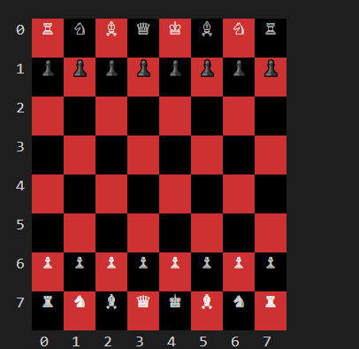

# Chess Game in Ruby

This is a command-line chess game built using Ruby. The game allows two players to compete against each other by taking turns to move pieces according to chess rules. The game includes features like check, checkmate, castling, and more. The gui utilizes ASCII characters to display the chess pieces.

<div align="center">
    
</div>


## Features

- Standard 8x8 chessboard setup.
- Move validation for all pieces (King, Queen, Bishop, Knight, Rook, Pawn).
- Special moves:
  - **Castling** (both kingside and queenside).
  - **Pawn promotion**.
- Check and checkmate detection.
- Input-based gameplay where players enter their moves.

## How to Play

1. Clone this repository to your local machine:

   ```bash
   git clone https://github.com/yourusername/chess-game.git

2. Navigate into the project directory:

   ```bash
   cd chess

3. Install dependancies
    ```bash
   bundle install

4. Run the game
    ```bash
   ruby main.rb

5. Type "help" to read how to play the game

## Possible Future Enhancements

- Implement AI for single-player mode.


   


